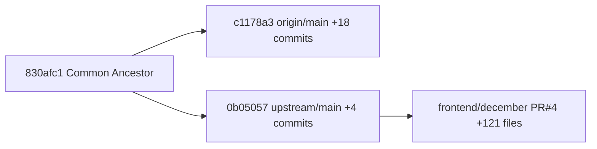

# PR #4 (Frontend/December) Merge Plan

## Current State Analysis




- **origin/main** (masaomi): 18 commits ahead of upstream (backend work: SLURM, gstore, legacy DB, etc.)
- **upstream/main** (fgcz): PR#3 merge only (HandsOnTable, etc.)
- **PR #4**: 121 files, 37,641 lines, `frontend/december` -> `upstream/main`
- **Current problem**: Aborted merge of `upstream/main` in progress with conflict in `backend/app/services/application_config_parser.rb`
- **pnpm-lock.yaml does not exist yet** -- PR uses `package-lock.json` (npm), conversion to pnpm required

## PR #4 File Categories (121 files)

- **A. Build/Config** (~10 files): package.json, next.config, tsconfig, eslint, jest->vitest migration, postcss/tailwind rename
- **B. Types & API** (~15 files): lib/types/*, lib/api/* -- new types, API functions
- **C. Hooks** (~12 files): new hooks (useApplicationForm, useImportDatasetForm, job hooks, etc.)
- **D. Components** (~4 files): DatasetTree -> DatasetTreeRcTree, new Header, Breadcrumbs, form-renderer
- **E. Pages - Dataset** (~15 files): dataset detail, samples edit, factors edit(new), parameters(new), import(new), run-application
- **F. Pages - Other** (~12 files): files browser(new), jobs, projects, help(new), ranking(new), layout
- **G. Docs** (~25 files): markdown docs + docs pages (additions, deletions, modifications)
- **H. Archive** (~20 files): `frontend/archive/` -- old code backups (low risk, just new files)
- **I. Test infra** (2 files): mocks/handlers.ts, mocks/server.ts
- **J. Misc** (2 files): example.html, README.md

---

## Phase 0: Clean Up Current State

The current `git merge upstream/main` is incomplete. Since origin/main already contains equivalent changes (commit `a5b7f8d` matches upstream's PR#3 content), this merge is redundant.

```bash
cd ~/Desktop/shortcuts/github/new_SUSHI_2025
git merge --abort
git status  # should show "nothing to commit, working tree clean"
```

## Phase 1: Fetch PR Branch and Create Merge Branch

```bash
git fetch upstream
git checkout -b merge/pr4-frontend-december main
```

This creates an isolated branch from origin/main for safe merge work.

## Phase 2: Merge and Resolve Conflicts

```bash
git merge upstream/frontend/december --no-commit
```

Using `--no-commit` to review before committing. Expected conflicts:

- Files modified by both origin's 18 commits and PR#4 (likely in frontend areas that overlap)
- `package-lock.json` vs pnpm usage

Review conflicts:

```bash
git diff --name-only --diff-filter=U  # list conflicted files
```

Resolve each conflict, then proceed.

## Phase 3: Build/Config Verification (Category A)

Key changes to verify:

- `package.json` -- new deps: rc-tree, vitest (replacing jest), ESLint flat config
- `jest.config.js` deleted, `vitest.config.ts` added (test framework migration)
- `next.config.ts` deleted, `next.config.js` modified
- `postcss.config.mjs` -> `postcss.config.cjs`, `tailwind.config.ts` -> `tailwind.config.cjs`

```bash
cd frontend
# Delete package-lock.json since we use pnpm
rm -f package-lock.json
pnpm install
pnpm run build
```

If build succeeds, this phase passes.

## Phase 4: Types, API, and Hooks Verification (Categories B, C)

Review key type changes in:

- [lib/types/dataset.ts](frontend/lib/types/dataset.ts) -- new Dataset/Sample types
- [lib/types/job.ts](frontend/lib/types/job.ts) -- expanded job types
- [lib/api/datasets.ts](frontend/lib/api/datasets.ts) -- new API functions
- [lib/api/jobs.ts](frontend/lib/api/jobs.ts) -- job API expansion
- New: `lib/api/files.ts`, `lib/types/files.ts`
- Deleted: `lib/api/misc.ts`, `lib/types/misc.ts`

TypeScript build in Phase 3 already validates type consistency. Manually spot-check API function signatures.

## Phase 5: Components and Pages Verification (Categories D, E, F)

Start dev server for visual verification:

```bash
cd frontend
pnpm dev
```

Manually check key pages:

- Dataset list page (major rewrite, 555 diff lines)
- Dataset detail page (247 diff lines)
- Jobs page (388 diff lines)
- Run application page (289 diff lines)
- New pages: files browser, dataset import, ranking, help

## Phase 6: Run Tests

```bash
cd frontend
pnpm test
```

The test framework migrated from Jest to Vitest. Verify tests pass under the new framework.

## Phase 7: Commit, Merge to Main, and Push

```bash
cd ~/Desktop/shortcuts/github/new_SUSHI_2025

# On merge/pr4-frontend-december branch
git add -A
git commit -m "Merge PR #4: Frontend December (rc-tree, new views, UI refactoring)"

# Merge to main
git checkout main
git merge merge/pr4-frontend-december

# Push to origin
git push origin main

# Push to upstream (mirror)
git push upstream main

# Cleanup
git branch -d merge/pr4-frontend-december
```

## Rollback Strategy

At any phase, if issues are found:

```bash
git checkout main
git branch -D merge/pr4-frontend-december
```

This safely discards all merge work without affecting main.